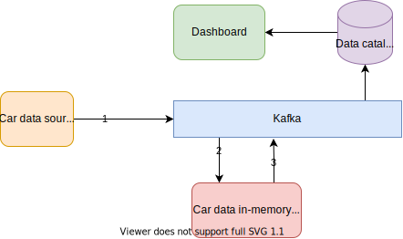

#  Car data dashboard

## Introduction
This is an example of how to build and deploy a frontend that will continuously display live data processed in Quix. The frontend is a simple website, available on a public URL, that is built using the Python libraries Plotly and Dash.
 
## Architecture
The dashboard will 
 
[](doc/car-demo-dashboard.svg "Architecture") 

## Installation
In your terminal, install several **dash** libraries.
```python
pip install dash
```

We also going to need **requests** library.
```python
pip install requests
```

## Getting data from Quix
First, we need to get data into Python using Data catalogue API and Connect feature of the portal. 

**Steps**:
1) Go to Visualize in the portal and select data to visualize. If you don't have any data in data cataloque, use another code example [car-data-sample](https://github.com/quixai/car-data-sample) and [car-data-model](https://github.com/quixai/car-data-model).
2) Click **Connect** button
3) Select Python as a language
4) Copy code to your dashboard project

## Code example
This is data catalogue request example generated by portal using **Connect** feature. Replace token with PAT token generated in portal. 
```python
def load_data():
    url = "https://telemetry-query-{placeholder:workspaceid}.platform.quix.ai/parameters/data"
    token = "{placeholder:token}"
    head = {'Authorization': 'Bearer {}'.format(token), 'Accept': "application/csv"}
    payload = {
        'numericParameters': [
            {
                'parameterName': 'Speed',
                'aggregationType': 'None'
            }
        ],
        'streamIds': [
        ],
        'groupBy': []
    }

    response = requests.post(url, headers=head, json=payload)

    panda_frame = pd.read_csv(io.StringIO(response.content.decode('utf-8')))

    if panda_frame.size > 0:
        # We convert nanoseconds epoch to datetime for better readability.
        panda_frame["Timestamp"] = panda_frame["Timestamp"].apply(lambda x: str(datetime.datetime.fromtimestamp(x / 1000000000)))
    return panda_frame
```

We use Dash to build web page with waveform:

```python
external_stylesheets = ['https://codepen.io/chriddyp/pen/bWLwgP.css']
app = dash.Dash(__name__, external_stylesheets=external_stylesheets)

app.layout = html.Div(children=[
    html.H1(children='Test dashboard'),
    html.Div(children='''
        Car speed
    '''),
    dcc.Graph(
        id='graph',

    ),
    dcc.Interval(
        id='interval_component',
        interval=5000,
        n_intervals=0,
        
    )
])
```

Then we implement update request to load data from **data catalogue**:
```python
@app.callback(Output('graph', 'figure'), [Input('interval_component', 'n_intervals')])
def update_data(n_intervals):
    try:
        data = load_data()

        scatter = go.Scatter(x=data["Timestamp"].to_numpy(), y=data["Speed"].to_numpy())

        fig = go.Figure(
            data=[scatter]
        )
        return fig

    except Exception:
        print(traceback.format_exc())
```

The last part is to run a server and set the port to **80** so you can host the dashboard in Quix.
```python
if __name__ == '__main__':
    # It is important to set port 80 to host this dashboard in Quix
    app.run_server(debug=True, host="0.0.0.0", port=80)
```

### Local test
Test this dashboard by running the python script and going to [http://localhost/](http://localhost/) in your browser.

## Quix deployment
You can deploy this dashboard in Quix. Please follow our documentation [here](https://quix.ai/docs/guides/how-to/manage-deployments/create-deployment.html). Please pay close attention to **Network** section.

## Full code example:
[source/main.py](source/main.py)
